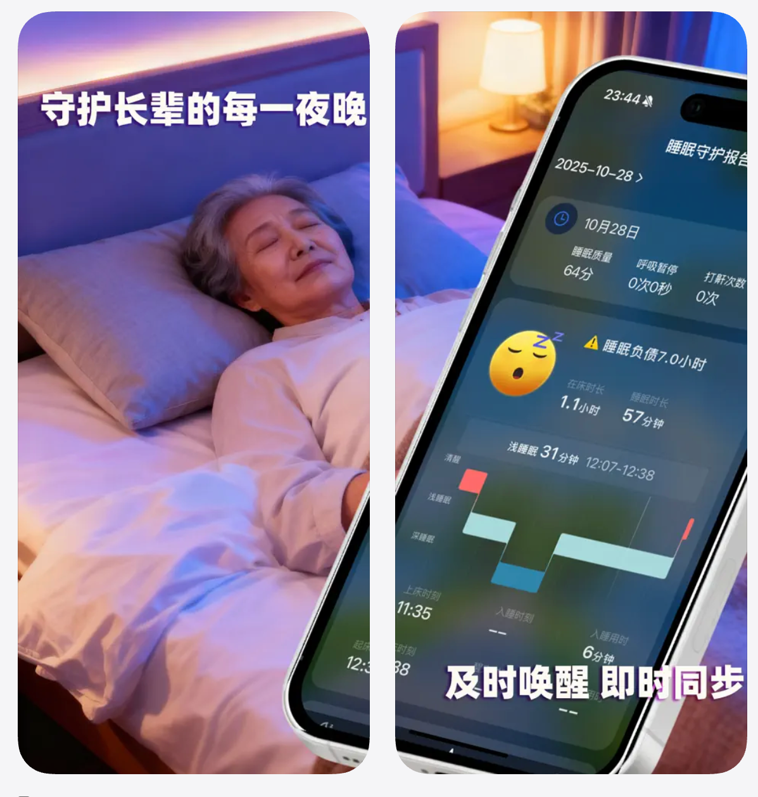
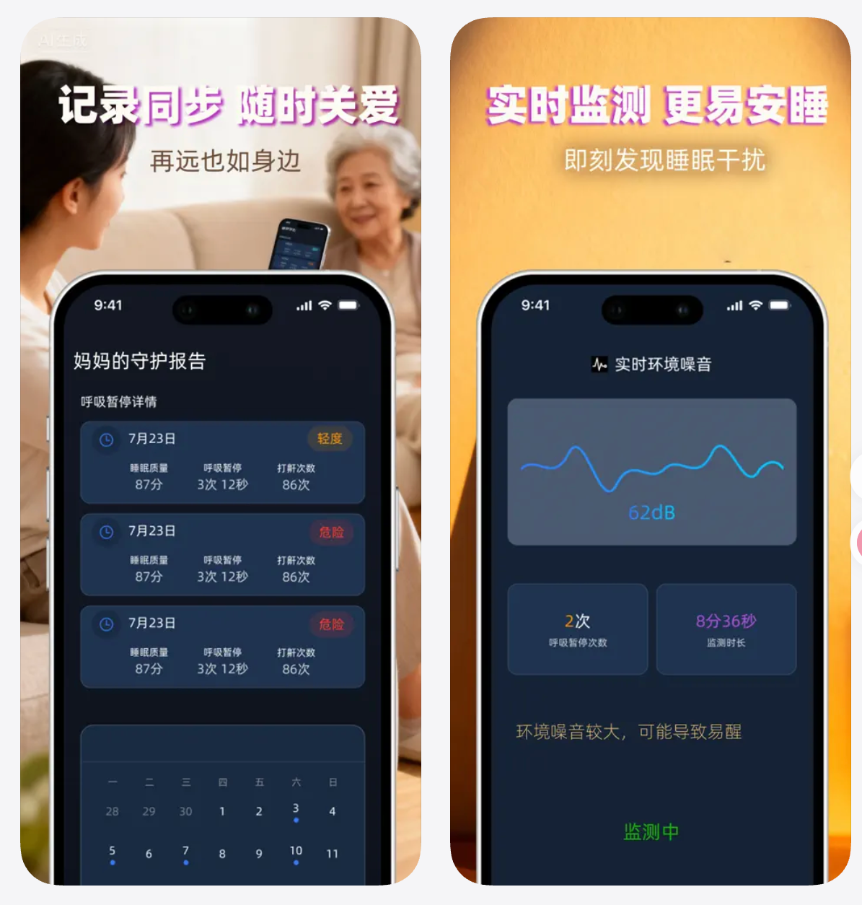
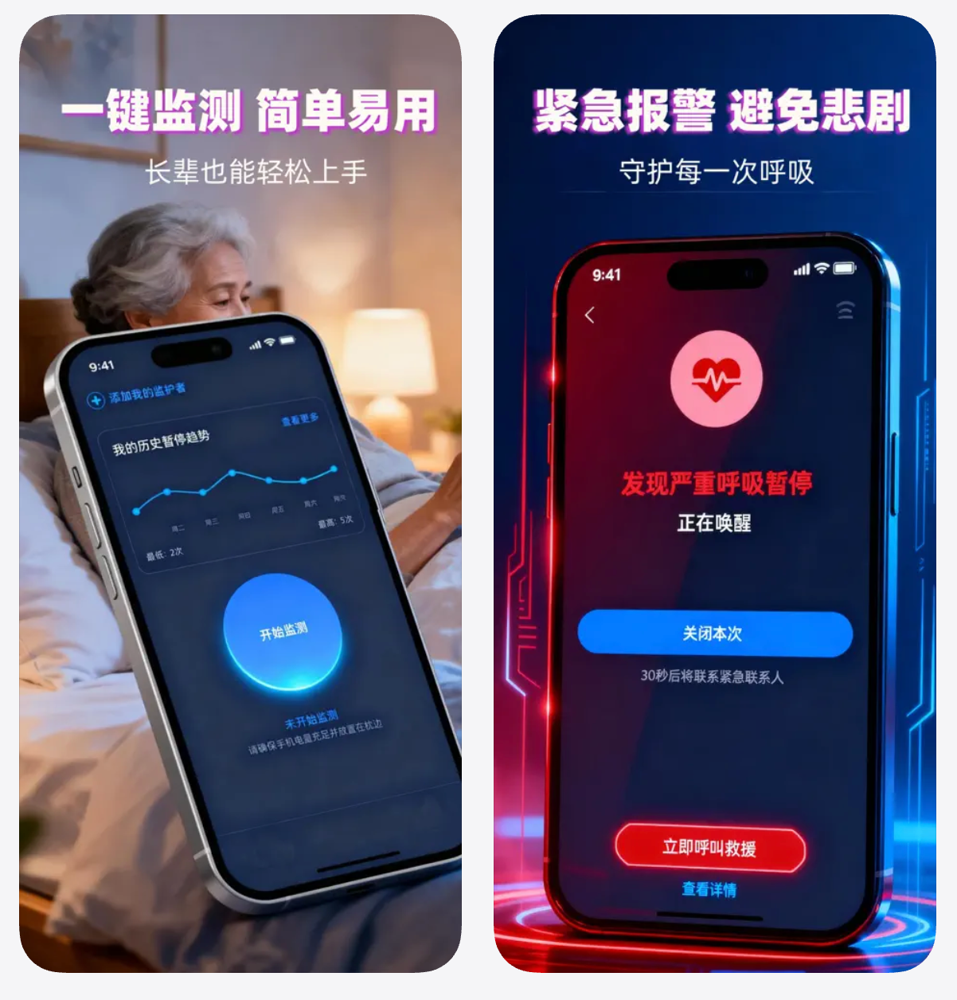

# Are you OK? (阿油 OK)

 

> **🇨🇳 中文版本**：[点击查看](./README_CN.md) | **🇬🇧 English** (current)

**Are you OK?** is an iOS App designed for **sleep respiratory safety of elderly living alone**. It uses intelligent algorithms to identify potential breathing pauses during sleep and supports **family data synchronization**, allowing you to protect your loved ones remotely.

> 💡 This project is a hackathon entry, aimed at shortening the distance of care through technology.

## ✨ Key Features

| Feature | Description |
|---------|-------------|
| 🛑 Apnea Alert | Automatically identifies potential breathing pauses at night, records and pushes reminders |
| 📊 Smart Sleep Tracking | Analyzes sleep structure, outputs total duration, deep sleep ratio, wake-up times |
| 📈 Historical Trends | Saves every sleep report, forms health trend charts |
| 👨‍👩‍👧 Family Sync | **Exclusive**: Sleep reports auto-sync to family members' phones |
| 🔔 Abnormal Alert | Immediately notifies emergency contacts when abnormalities are detected |
| 👵 Senior Mode | Large fonts + minimalist interface, easy for elders to use |

## 📱 Download

**Compatibility**: iOS 13.0 or later (iPhone)

## 📸 Screenshots

| Sleep Report | Family Sync | Senior Mode |
|:---:|:---:|:---:|
|  |  |  |

*Replace the image files above with your own screenshots. Recommended naming: `screenshot1.png`, `screenshot2.png`, `screenshot3.png` inside `assets/` folder.*

## 🔒 Privacy & Security

- Data collection follows minimal necessity principle. See [Privacy Policy](http://www.hiapnea.com/resource/privacyPolicy.html)
- Health data is **not linked** to personal identity
- Subscription options: monthly, quarterly, yearly, and lifetime (limited founding members)

## ⚠️ Medical Disclaimer

This App and its data are for **personal health management reference only** and cannot replace professional medical diagnosis. Please consult qualified medical professionals for any health concerns.

## 🗺️ Roadmap (Post-Hackathon)

- [ ] Snore analysis and audio reports
- [ ] Apple Watch standalone detection
- [ ] Family-side widgets
- [ ] Integration with more health data (heart rate, blood oxygen)

## 📄 License

This project is **not open source**. The App is available for download via the [App Store](https://apps.apple.com/cn/app/%E9%98%BF%E6%B2%B9ok/id6752334239). All rights reserved.
